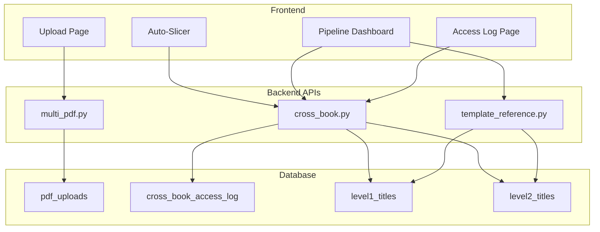

# Design Document: Multi-PDF Upload & Cross-Book Attribute Access

## Overview

This design document describes the architecture and implementation for three interconnected features:
1. **Multi-PDF Upload** - Support for multiple PDF files per book with flexible page mapping
2. **Cross-Book Attribute Access** - Read/write attributes across books with audit logging
3. **Template Reference UI** - Autocomplete and browser for referencing book attributes

The backend implementation is complete (API routes, database schema). This design focuses on the remaining frontend components that need to be built.

## Architecture

### System Context



### Data Flow

1. **Multi-PDF Upload Flow**:
   - User selects additional PDF → Upload API validates and stores file
   - System detects overlaps → UI shows resolution modal
   - User resolves overlaps → API updates page mappings
   - Page access resolves correct PDF via page mapping lookup

2. **Cross-Book Access Flow**:
   - Pipeline rule references `@BookA.L1.Title.attr22`
   - System parses reference → Calls cross-book API
   - API validates writable range → Performs read/write
   - All writes logged to audit table

3. **Template Reference Flow**:
   - User types `@` in template editor
   - Frontend calls search API with partial query
   - Dropdown shows filtered results
   - User selects → Reference inserted with syntax highlighting

## Components and Interfaces

### Component 1: Multi-PDF Upload UI (upload.html)

**Location**: `03-code/src/frontend/templates/upload.html`

**New Elements**:
- "Upload Additional PDF" button (visible when book has existing PDFs)
- Page mapping form with inputs for PDF start page and book start page
- Overlap resolution modal

**Interface**:
```javascript
// Show additional PDF upload section
function showAdditionalPdfUpload(bookId) {
    // Fetch suggested start page
    // Display page mapping form
}

// Handle overlap resolution
function showOverlapModal(overlaps) {
    // Display modal with overlap list
    // Radio buttons for each overlap
    // "Apply to all" checkbox
}

// Submit overlap resolutions
async function resolveOverlaps(bookId, resolutions) {
    // POST to /api/books/{book_id}/resolve-overlaps
}
```

**API Endpoints Used**:
- `GET /api/books/{book_id}/suggested-start-page`
- `POST /api/books/{book_id}/upload-pdf`
- `POST /api/books/{book_id}/resolve-overlaps`
- `GET /api/books/{book_id}/pdf-uploads`

### Component 2: Template Reference Autocomplete (pipeline-dashboard.html)

**Location**: `03-code/src/frontend/templates/pipeline-dashboard.html`

**New Elements**:
- Autocomplete dropdown triggered by `@` symbol
- Reference browser modal with tree view
- Syntax highlighting for inserted references

**Interface**:
```javascript
// Initialize autocomplete on template input fields
function initTemplateAutocomplete(inputElement) {
    // Listen for @ keypress
    // Show dropdown on trigger
    // Filter results as user types
}

// Autocomplete dropdown component
class TemplateAutocomplete {
    constructor(inputElement) {}
    show(results) {}
    hide() {}
    selectItem(reference) {}
    navigateUp() {}
    navigateDown() {}
}

// Reference browser modal
function openReferenceBrowser() {
    // Fetch tree structure
    // Render expandable tree
    // Handle selection
}

// Syntax highlighting
function highlightReferences(text) {
    // Parse @Book.Level.Title.attr patterns
    // Apply color spans
}
```

**API Endpoints Used**:
- `GET /api/template-reference/search?query=...`
- `GET /api/template-reference/tree`

### Component 3: Cross-Book Access Log Page

**Location**: `03-code/src/frontend/templates/cross-book-log.html` (new file)

**Elements**:
- Filter controls (source book, target book, date range)
- Log table with columns: Timestamp, Source, Target, Attribute, Operation, Values
- Export to CSV button
- Pagination

**Interface**:
```javascript
// Load audit log with filters
async function loadAuditLog(filters) {
    // GET /api/cross-book/audit-log with query params
}

// Export to CSV
function exportToCsv(logs) {
    // Generate CSV content
    // Trigger download
}
```

**API Endpoints Used**:
- `GET /api/cross-book/audit-log?source_book_id=...&target_book_id=...&limit=...`

### Component 4: Writable Range Configuration (auto-slicer.html)

**Status**: ✅ Already implemented in auto-slicer.js

The Auto-Slicer UI already includes writable range inputs for L1/L2 titles.

## Data Models

### Existing Database Schema (Already Implemented)

**pdf_uploads table**:
```sql
- id: SERIAL PRIMARY KEY
- book_id: INTEGER (FK to books_metadata)
- filename: VARCHAR(255)
- file_path: TEXT
- file_size_bytes: BIGINT
- pdf_start_page: INTEGER (first page in PDF to count from)
- book_start_page: INTEGER (book page number for pdf_start_page)
- total_pdf_pages: INTEGER
- book_page_start: INTEGER (calculated)
- book_page_end: INTEGER (calculated)
- upload_order: INTEGER
- status: VARCHAR(50) ['active', 'replaced', 'deleted']
- uploaded_at: TIMESTAMP
```

**cross_book_access_log table**:
```sql
- id: SERIAL PRIMARY KEY
- source_book_id: INTEGER (FK)
- source_pipeline_rule: VARCHAR(255)
- source_pipeline_number: INTEGER
- target_book_id: INTEGER (FK)
- target_level: VARCHAR(10) ['L1', 'L2']
- target_title_id: INTEGER
- target_attribute: VARCHAR(20)
- old_value: TEXT
- new_value: TEXT
- operation: VARCHAR(20) ['write', 'increment']
- created_at: TIMESTAMP
```

### Frontend State Models

**OverlapResolution**:
```typescript
interface OverlapResolution {
    page: number;
    keepPdfId: number;
    existingFilename: string;
    newFilename: string;
}
```

**TemplateReference**:
```typescript
interface TemplateReference {
    reference: string;        // Full reference string
    bookId: number;
    bookName: string;
    level: 'L1' | 'L2';
    titleId: number;
    titleText: string;
    attributeNum: number;
    attributeName: string | null;
    isWritable: boolean;
}
```

**AuditLogEntry**:
```typescript
interface AuditLogEntry {
    id: number;
    sourceBookId: number;
    sourceBook: string;
    pipelineRule: string;
    pipelineNumber: number;
    targetBookId: number;
    targetBook: string;
    targetLevel: string;
    targetTitleId: number;
    attribute: string;
    oldValue: string | null;
    newValue: string;
    operation: 'write' | 'increment';
    timestamp: string;
}
```
